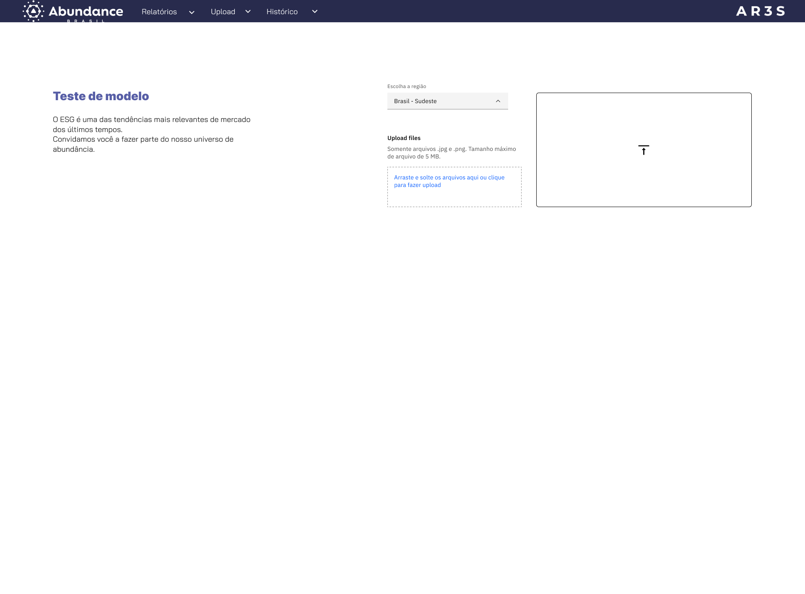

 

Considerando o modelo mental de um usuário  da Abundance não necessariamente técnico, está a procura de dados em relação a contabilidade de árvores. O objetivo
dessa tela inicial é fazer com o trabalho cognitivo e de consistência entre as páginas seja de fato efetivo, levando uma fluidez maior na experiência.

Após clicar em “Acessar relatórios” o usuário irá entrar na nessa tela, ontem teremos dados sobre a última pesquisa e submissão de imagem, que vai relacionar a quantidade de árvores com o mapeamento do terreno. O gráfico à direita por enquanto é apenas um exemplo de como esses dados poderiam ser visualizados, após uma maior maturidade do modelo será possível constatar dados reais sobre a contagem das árvores em determinada floresta. 

Em seguida, após clicar em “Upload”, será possível carregar a imagem da floresta que vai ser contabilizada as árvores, ao lado esquerdo a ideia é que trazemos informações precisas sobre o modelo em que estamos utilizando, qual é sua versão e um sucinto texto explicativo sobre a IA. 

Após o treinando no modelo será apurado na imagem plotada, irá aparecer informações sobre a quantidade de árvores e o período de visualização da imagem.

Por fim, dedicaremos uma visualização do histórico dos uploads passados, com informações como: ID da imagem, região da floresta, data, e a versão do modelo que utilizamos. 
